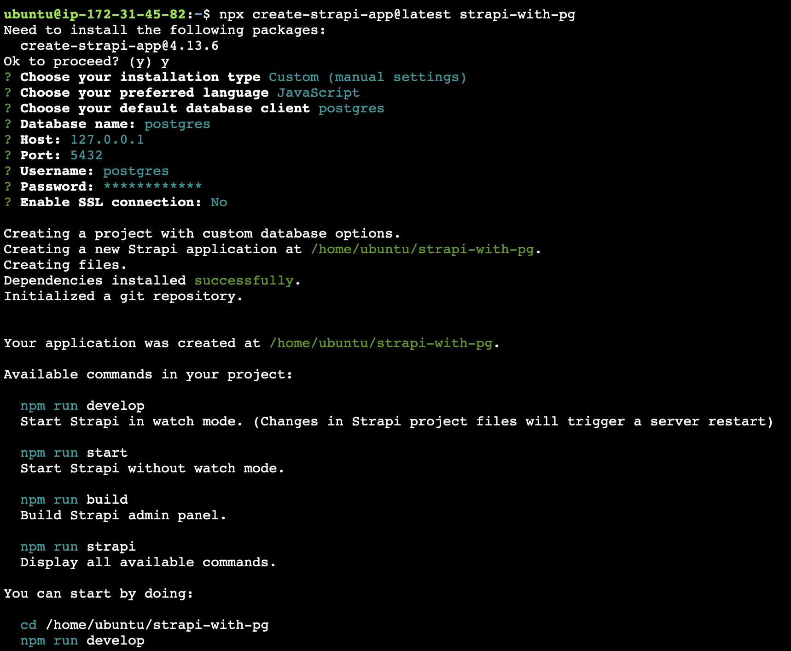
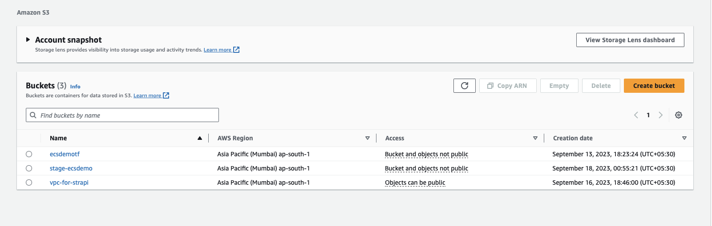
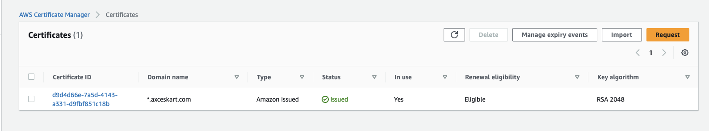
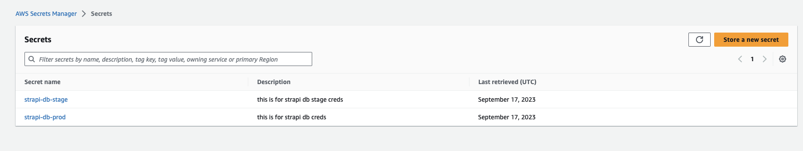
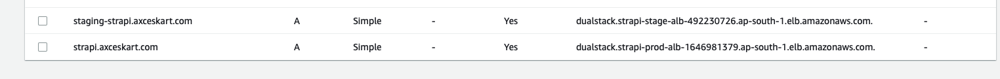
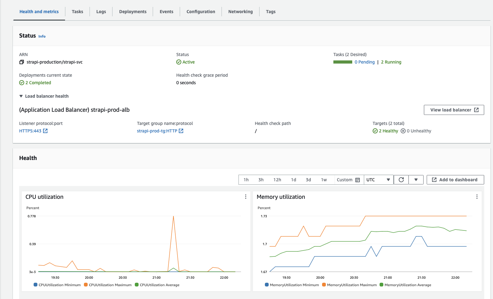
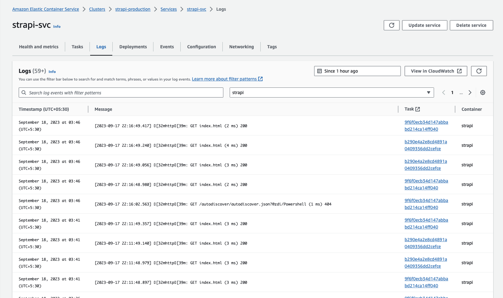
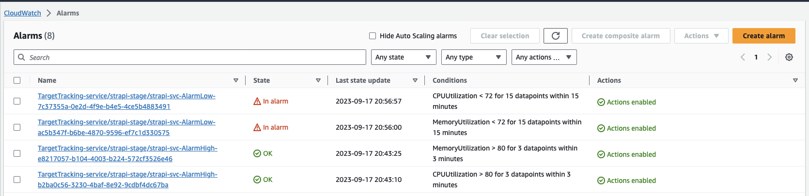
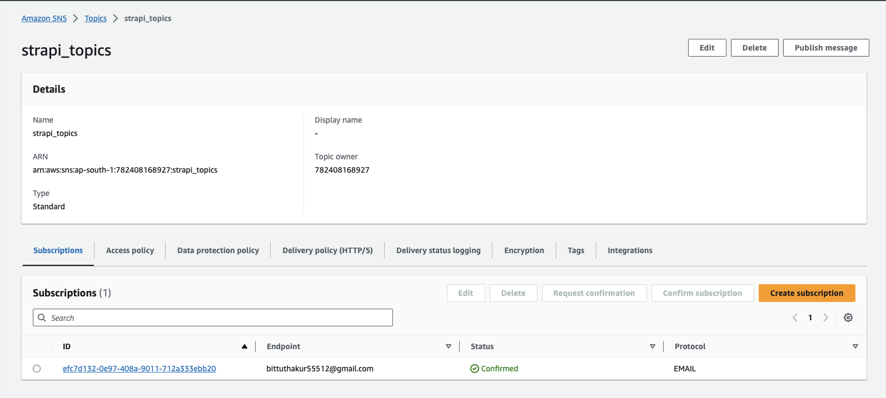

# strapi-with-ecs

**HERE IS YOUR WORKING URL FOR PROD AND STAGE**

**FOR PROD** https://strapi.axceskart.com/admin/

**FOR STAGE** https://staging-strapi.axceskart.com/admin/


**IMPORTANT** All requirements are fulfilled, all the sensitive informations are coming form secrets manager, as per best practise ECS cluster is in the private subnets , RDS cluster is also in provate subnets , applications are accecible only from Loadbalancer which is assoitaed with my domain.


**STEPS TO CREATE THIS WHOLE PROJECT**


**NOTE** HERE I AM USING MY OWN EC2 SERVER TO PERFORM THIS TASK (for example creating the apps, build the apps and push the apps...)


**Step-1:** First of all you need to create strapi project with customs settings and choose postgres-client, below you can find commands & screen shots...

```
npx create-strapi-app@latest strapi-with-pg
```



**Step-2:** After that go to this folder and create Dockerfile for containerize this strapi applications and create database.js file and .dockerignore file in here the content of database.js and .dockerignore file.

**for database.js**

```
module.exports = ({ env }) => ({
    connection: {
      client: 'postgres',
      connection: {
        host: env("DATABASE_HOST"),
        port: env.int("DATABASE_PORT"),
        database: env("DATABASE_NAME"),
        user: env("DATABASE_USERNAME"),
        password: env("DATABASE_PASSWORD"),
        ssl: {
          rejectUnauthorized: env.bool('DATABASE_SSL_SELF', false), // For self-signed certificates
        },
      },
      debug: false,
    },
  });

```
**for .dockerignore** 

```
node_modules/
.tmp/
.cache/
.git/
build/
```

**Step-3:** Now build the dockerfile for both prod and stage and push into ECR repository... 

**Here is the command for build**

```
docker build -t mystrapiopss:latest  --build-arg NODE_ENV=production .
```
Here ECR gives me how to push this image on ECR so i will not show here due to personal data informations...

**NOTE** one more thing is during the build it gives me lots of dependencies error, but after debugging and researching i found that the problem is in the node alpine base image so i changed from to official node:18.17.1-buster.


**Step-4:** So i already have me own domain which is hosted on Go-daddy, but according to your use-cases you want Route53 so i created and migrated my DNS nameserver from GO-daddy to Route53 Manually because DNS are very critical things...

**Step-5:** After that i created followinf resources...

1. S3 buckets (3 buckets) one for vpc , second is  for prod and 3rd is for stage env for storing our terraform state files as per the best practise..
2. ACM wild-card certificates for our domain.
3. and 2  secrets in Secrets manger for storing sensitive infomation just like DB username , password, token etc. here you can find the screenshots.. these thing 







**Step-6:** After that i go to networks folder which is to creating the VPC and use these terraform commands:-

```
terraform init
```

```
terraform plan
```

```
terraform apply
```
So in here our vpc is created with best practises...

**Step-7:** Then i go to  prod folder and apply the same terraform commands inside aurora-db folder to create aurora-db postgress cluster with Multi-AZ & 2 instance one for writer and another is for reader.

**Step-8:** Then i go to ecs-cluster folder and apply the same terraform commands to create the ecs cluster with autoscaling


**Step-9:** Then same things for stage folder but in  here difference is Aurora-db does not have Multi-AZ because this is the stage env, we dont want too much of cost.. and only 1 db-instance for writer & in ecs-cluster here i am using FARGATE_SPOT to save the cost.

**Final-steps** binded the prod and staging ALB into route53 with custom domain. see this..




**Here you can see the applications logs, monitoring, and alarams, so through terraform i created a sns topic too for sending alerts to my email**









